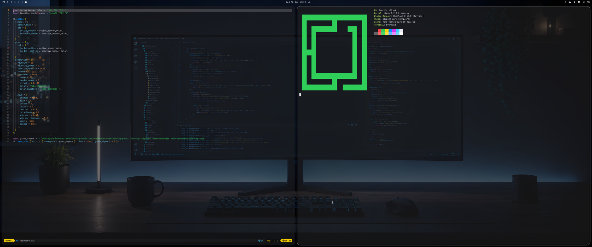

# Liquid Glass for Omarchy

[](https://omarchy.org/)
[](https://hypr.land/)
[](LICENSE)

A dark Omarchy theme based on Apple's Liquid Glass. Windows, the bar, menus, notifications and the terminal are translucent with a frosted blur behind them. Colors come from Apple's 2025 dark mode system palette (blue `#0091ff`, red `#ff4245`, green `#30d158`, purple `#db34f2`), app icons keep their own colors and folders are yellow.



Hyprland can blur and round corners, but it can't bend light, so there is no refraction or moving highlight on the edges like on macOS 26. What you get is frosted glass.

## Install

```bash
git clone https://github.com/gabrielsitta4/omarchy-liquid-glass-theme ~/.local/share/omarchy-liquid-glass-theme
ln -s ~/.local/share/omarchy-liquid-glass-theme ~/.config/omarchy/themes/liquid-glass
omarchy theme set liquid-glass
```

Use the link instead of `omarchy theme install`. For security, Omarchy drops `hyprland.lua` and `foot.ini` from themes it clones, and those two files hold the blur, the rounded corners and the terminal transparency. A linked folder keeps them. `hyprland.lua` is 46 lines of plain settings, worth a read before you run it.

`omarchy theme install https://github.com/gabrielsitta4/omarchy-liquid-glass-theme` also works, but you only get the colors, the translucent bar and menus, the icons and the wallpaper. Without the blur, the translucent parts just show what's behind them.

## Update

```bash
git -C ~/.local/share/omarchy-liquid-glass-theme pull
omarchy theme set liquid-glass
```

## What it changes

- `hyprland.lua`: blur with vibrancy, 18px rounded corners, soft shadow, thin white border on the focused window, blur on the bar, menus, notifications, OSD and [DockPlus](https://github.com/gabrielsitta4/dockplus) if you use it.
- `shell.toml`: bar at 45% opacity, menus and notifications at 55%, white highlight on the selected item.
- `foot.ini`: terminal background at 72% opacity. Only foot gets transparency; other terminals get the colors.
- `icons.theme`: Yaru-yellow-dark.
- `backgrounds/setup-4k.png`: the wallpaper, made by me.

## Uninstall

```bash
omarchy theme set tokyo-night
rm ~/.config/omarchy/themes/liquid-glass
rm -rf ~/.local/share/omarchy-liquid-glass-theme
```

Swap `tokyo-night` for whatever theme you had before.
